# Verbindmappen

## Inleiding

VerbindMappen is een klein programmaatje geschreven in Windows Powershell. Het is een heel handig hulpmiddel voor als je regelmatig dezelfde netwerk verbindingen naar gedeelde netwerk mappen wilt maken. Het bestaat uit een folder met een aantal bestandjes waarmee je je eigen netwerk inlog instellingen kunt aanmaken en gebruiken.

Om gedeelde netwerk mappen te kunnen verbinden zijn een aantal dingen nodig.

Het eerste wat nodig is, zijn natuurlijk gedeelde netwerk mappen. Dit zijn mappen die door je netwerk beheerder zijn gemaakt en welke door jou en andere gebruikers (of door jou alleen als het om een privémappen gaat) gebruikt kunnen worden. Vrij beschikbare netwerk mappen kun je heel makkelijk zichtbaar maken door in je netwerk omgeving te gaan rondkijken, zoals je hieronder ziet weergegeven:

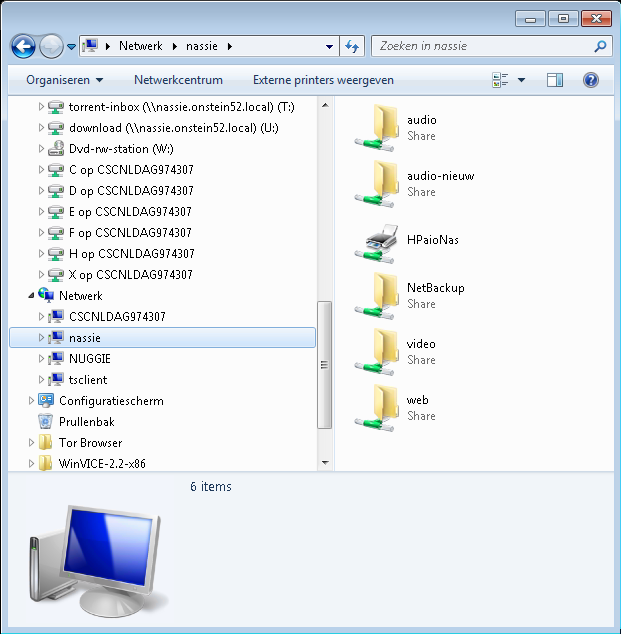

De mappen rechts in het venster zijn gedeelde netwerk mappen. Ze worden via het netwerk aangeboden door een server die **nassie** heet (links in het venster te zien). Je ziet hier alleen de door de netwerkbeheerder zichtbaar gemaakte mappen. Er kunnen ook verborgen mappen bestaan en deze zul je niet zo makkelijk vinden en verbinden.
Zowel de zichtbare als de niet zichtbare gedeelde netwerk mappen kunnen aan een schijfletter verbonden worden, zodat de mappen wat makkelijker terug te vinden zijn in je windows verkenner. Bovendien is dit de makkelijkste manier om de verborgen netwerk mappen terug te kunnen vinden. Een aan een schijfletter verbonden netwerk map ziet er in de verkenner zo uit:

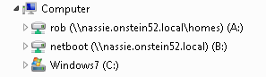

Schijven A: en B: zijn beiden aan een schijfletter verbonden netwerk mappen. Deze mappen kunnen in alle windows programma’s gewoon als elke andere schijf behandeld worden.

## Hoe te gebruiken

Om een netwerkmap aan een schijfletter te verbinden zijn 4 dingen nodig:

- Een vrije schijfletter
- De naam van de gedeelde netwerkmap
- Een geldige gebruikersnaam waarmee de map gebruikt mag worden
- Een wachtwoord welke hoort bij deze gebruikersnaam

Je kunt tientallen van deze netwerk schijven aanmaken, afhankelijk van de vrije schijfletters en beschikbare netwerk mappen.
Het VerbindMappen programmaatje helpt je om deze informatie op te slaan zodat je die op elk moment met een paar simpele muisklikken kunt gebruiken om netwerkmappen te verbinden op de manier zoals jij dat het handigst vind.

### Het eerste gebruik van VerbindMappen

Dat gaat zo.

**Stap 1:** Plaats de VerbindMappen map met inhoud ergens op je harde schijf. Doe dit op een plaats die je makkelijk kunt terugvinden. Maak bijvoorbeeld een map aan in je persoonlijke folder die je AktieveScripts noemt en zet daar de VerbindMappen folder met inhoud in. Dat zou er ongeveer zo uit moeten zien:

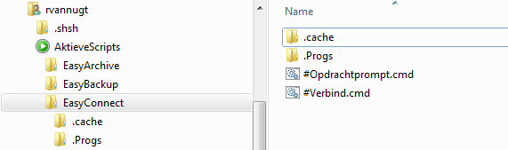

**Stap 2:** Dubbelklik op het bestand #Verbind.cmd. Deze actie zal een dialoog starten die om het te gebruiken account en wachtwoord vraagt welke nodig zijn om de netwerk mappen te verbinden. Hieronder een voorbeeld van wat je zult zien als resultaat:

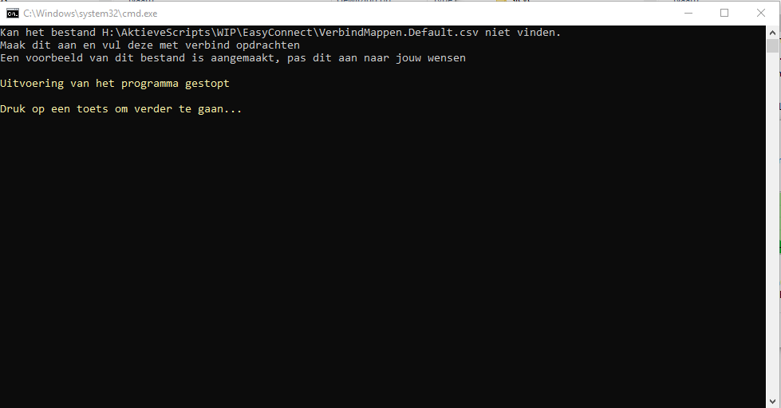

**Stap 3a:** Bepaal de vrije schijfletters welke je wilt gebruiken om de gedeelde netwerkmappen aan te verbinden. Deze kun je bepalen door je windows verkenner te openen en vervolgens Computer of Mijn Computer te selecteren in het linker deel van het venster. Je ziet nu welke schijfletters in gebruik zijn:

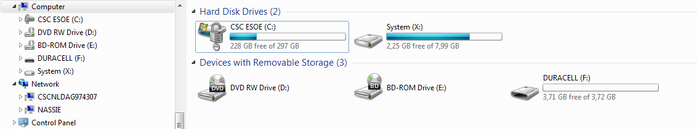

In dit voorbeeld zijn schijfletter C:, X:, D:, E: en F: al in gebruik en zijn dus niet vrij. Alle andere letters kunnen als vrije schijfletters gebruikt worden. Je zult voor elke gedeelde netwerk map een schijfletter nodig hebben. Hou hiermee rekening met het feit dat USBsticks en externe hardde schijven ook schijfletters kunnen bezetten. Deze gebruiken meestal de “lage letter reeks” die direct na de CD of DVD schijfletter(s) komt, dus E:, F:, G:, H:, etc.. Het is een goede gewoonte om ook deze reeks als “bezette” schijfletters te beschouwen.

*Tip: de meeste moderne computers hebben geen floppy-disk drives meer. Deze floppy-disk drives gebruikten de letters A: en B:. Omdat deze tegenwoordig niet meer gebruikt worden, zijn dit vaak hele goede kandidaat schijfletters om gedeelde netwerkmappen te verbinden.*

**Stap 3b:** Bepaal de namen van de gedeelde netwerkmappen welke je wilt verbinden. Doe dit samen met je netwerk beheerder; hij of zij kan je vertellen welke netwerk mappen er voor jou beschikbaar zijn. De namen van deze mappen zien er ongeveer zo uit:
[naam van de server]\[naam van de map], bijvoorbeeld

```text
Nassie\homes\rob
Nassie\audio
Nassie\video
```

Of, als jouw netwerk onderdeel uitmaakt van een serie aan elkaar gekoppelde netwerken en een lokale domein naam server heeft (vraag dit aan je netwerk beheerder):

```text
Nassie.jouwnetwerk.local\homes\rob
Nassie.jouwnetwerk.local \audio
Nassie.jouwnetwerk.local \video
```

**Stap 4:** Open het bestand wat in stap 2 genoemd is als Verbindmappen.[mappennaam].csv met het programma kladblok en vul in hoe je de netwerkmappen wilt koppelen aan de vrije schijfletters, zoals in onderstaand voorbeeld te zien is:

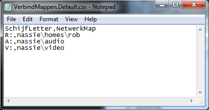

Let er goed op dat je de tekst in de eerste regel LETTERLIJK zo overneemt dan wel laat staan en niet wijzigt. Sla de wijzigingen op.
En dat is het. Een dubbelklik op het bestand #Verbind.cmd zal proberen de netwerk verbindingen te maken! Gedurende dit proces zal #verbind.cmd vragen om de nodige login gegevens die nodig zijn om deze verbindingen te maken. Zorg dus dat je de inlog gegevens die voor deze gedeelde mappen nodig zijn bij de hand hebt. Vraag je netwerkbeheerder welk login account er voor jou aangemaakt is en welk wachtwoord te gebruiken.

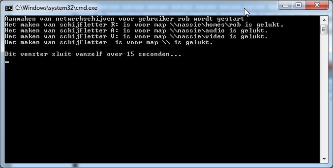

Als je maar met één set verbonden netwerk mappen hoeft te werken, is dit alles!

### Het instellen van VerbindMappen voor twee of meer accounts

Stel dat je meerdere accounts hebt waarmee je op de netwerk server of de NAS mee kunt aanmelden, of je wilt plezier en werk gescheiden houden en dus twee verschillende sets verbonden netwerk mappen gebruiken. Bijvoorbeeld één om spellen te spelen en één om je administratie mee te doen. Met VerbindMappen is het mogelijk dat je hier verschillende schijf – naar – netwerkmappen verbindingen voor instelt. In het ene geval wil je maar één verbinding maken, bijvoorbeeld schijf S: verbinden aan je gedeelde map nassie\spelletjes en in het andere geval wil je een verbinding maken van schijf A: naar nassie\administratie en schijf S: naar je administratie spreadsheets. Je kunt dan een tweede “verbind-set” maken.
Als je de eerste verbind-set al hebt aangemaakt om schijf S: te verbinden met nassie\spelletjes, kun je een tweede verbind set maken door dit te doen:

**Stap 1:** Open een VerbindMappen Opdrachtprompt. Dit doe je door te dubbelklikken op het bestand #Opdrachtprompt.cmd wat in jouw VerbindMappen map staat. Tik hier in:

```msdos
#Verbind –MappenBestand [AlternatieveNaam]
```

Bijvoorbeeld:

```msdos
# Verbind – MappenBestand Administratie
```

**Vervolgstappen:** Je zult nu een dialoog zien die exact hetzelfde is als die je gezien hebt bij het eerste gebruik. Het enige verschil is, dat nu een Verbindmappen bestand gemaakt wordt met de identificate die gelijk is aan de door jouw opgegeven MappenBestand naam “Administratie”, dus *Verbindmappen.Administratie.csv*. Het configuratiebestand voor deze mappenset moet je aanpassen op dezelfde manier als je dat voor Verbindmappen.Default.csv gedaan hebt. Hierin komen de te verbinden netwerk mappen te staan die je voor je administratie wilt gebruiken, dus:

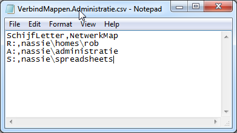

Als je de mappen voor je administratie wilt verbinden, kun je dit doen door op #Verbind.Administratie.cmd te dubbelklikken:

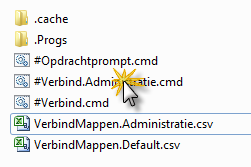

## ...En dan nog:

### Het duurt soms wat langer...

Soms duurt het even voor een netwerk map gevonden is. Vooral als er iets mis gaat, zal het VerbindMappen programma wat langer “stil” blijven als je gewend bent. Wees daarom geduldig als de dialoog even niet vooruit lijkt te komen.

### Foutje... Bedankt!

Het programma doet meerdere pogingen om de verbindingen te maken. Als er iets fout gaat tijdens het uitvoeren van het programmaatje en het lukt helemaal niet, bestudeer dan aandachtig de meldingen die het programma produceert. Hier zitten altijd nuttige suggesties bij om de fouten op te lossen.

### Beveiligings waarschuwing.

Denk hieraan!!:

Jouw gebruikers account en wachtwoord waarmee je verbinding maakt met de netwerkmappen worden weliswaar op een veilige manier opgeslagen op jouw windows machine en zijn alleen te gebruiken als ze gebruikt worden met jouw windows gebruikers account, maar..... Zorg er dan wel voor, dat niemand op jouw windows machine en met jouw gebruikers account kan werken, met andere woorden, beveilig jouw windows werkstation log in met een wachtwoord:

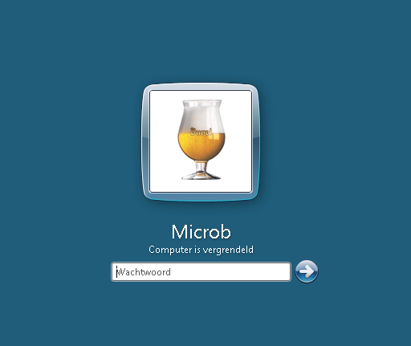

## Windows tips:

### Tip 1: Verbindmappen automatisch opstarten bij login

Als je eenmaal je #Verbind.*xxx*.cmd bestandjes hebt aangemaakt, kun je hier snelkoppelingen van maken op een paar strategische plaatsen, zoals:
In je Startmenu in de Opstarten folder (alleen voor Windows 7):

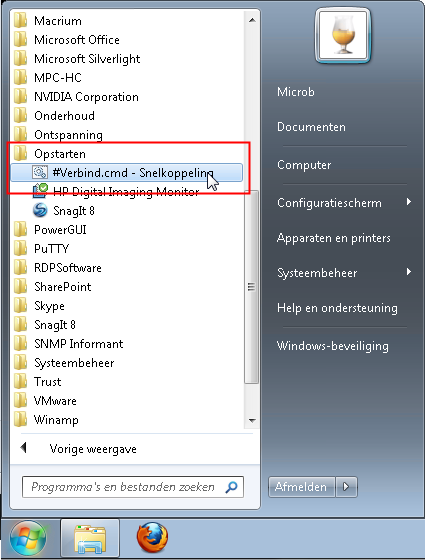

Als je dat doet, worden de netwerk mappen automatisch gekoppeld elke keer als je aanlogt. Je hoeft dan niet iedere keer je VerbindMappen map op te zoeken en te dubbelklikken.

*Hoe?:* Zoek het #Verbind.cmd bestandje wat je in je Start menu, Opstarten wilt zetten op en klik met de rechter muisknop en houdt deze knop ingedrukt. Beweeg je muis aanwijzer naar het Startmenu, en je zult zien dat deze zich opent. Navigeer door het startmenu (rechtermuisknop nog steeds ingedrukt houden!!) naar Alle Programma’s en naar de map Opstarten. Hou de muisaanwijzer op de map opstarten totdat deze zich opent. Beweeg de muis aanwijzer nu “in” de map Opstarten en laat dan de rechtermuisknop los. Voila!

Dezelfde truc kun je ook uitvoeren op een Windows 10 machine. Daar moet je echter in de windows verkenner in de adresbalk %Appdata% invullen. Vervolgens “browse” je naar C:\Users\[JouwGebruikersNaam]\AppData\Roaming\Microsoft\Windows\Start Menu\Programs\Startup, en maak je de snelkoppeling in deze map aan.

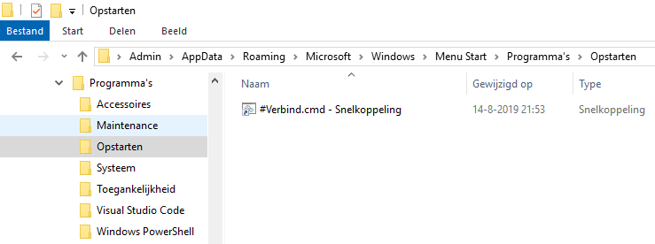

Let wel: bij deze methode krijg je hoogst waarschijnlijk foutmeldingen wanneer je NIET met je eigen netwerk verbonden bent. 

### Tip 2: Verbindmappen alleen uitvoeren op eigen netwerk

Om te voorkomen dat Verbindmappen geactiveerd word als je niet op je eigen netwerk bent verbonden, kun je de volgende extra stappen uitvoeren:

- Open een commando prompt en tik hier in:\
\
ipconfig\
\
en zoek daar de adapter waarmee je met je  netwerk verbonden bent (in mijn geval is dat Ethernet Adapter Ethernet) en bepaal het IP adres waarmee je bent verbonden:\
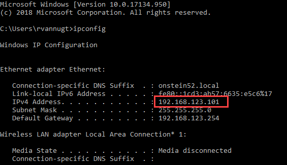
- Open het bestand #verbind.cmd en gebruik het gevonden IP adres om aan te geven wanneer er een poging gedaan mag worden om de verbindingen te maken. Je mag hier zogenaamde masker karakters gebruiken, zoals de *. Dit is verstandig om te doen, en in de meeste gevallen is het het beste om het laatste getal te vervangen door een *. In mijn voorbeeld zou dat er zo uit zien:\
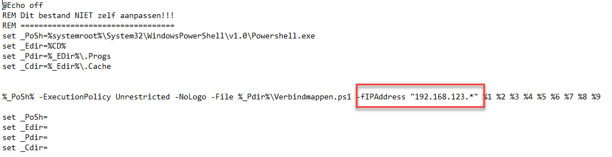

Het programma zal nu alleen maar een verbinding proberen te maken als je aan je netwerk verbonden bent.1
Ik hoop dat je veel plezier en gebruikersgemak aan het gebruik van VerbindMappen mag beleven!